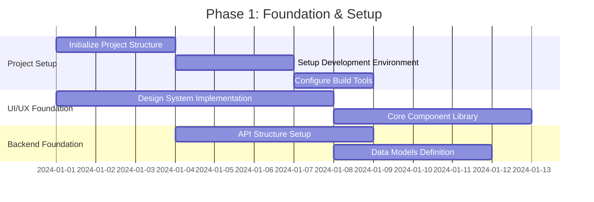
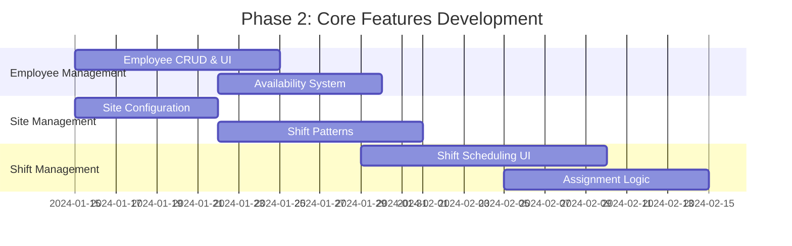
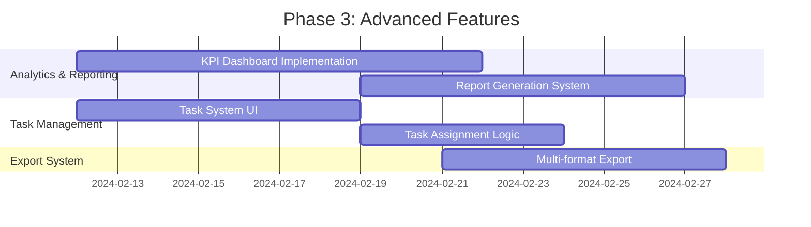
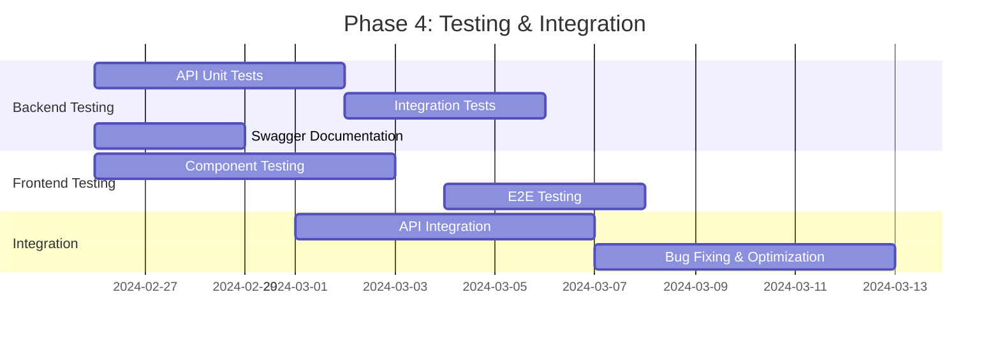
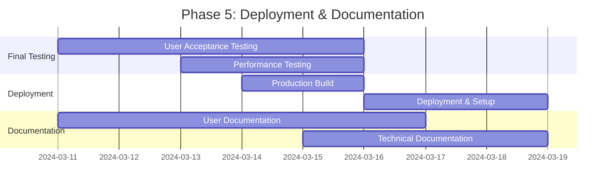

# Security Guard Shift Scheduling System - Development Plan

## 🎯 Project Overview
**Project**: Security Guard Shift Scheduling System  
**Timeline**: 12 Weeks  
**Team**: 3 Developers (Full Stack) + 1 UI/UX Designer  
**Technology Stack**: React + TypeScript + Node.js + Express + LocalStorage

---

## 📅 Development Phases & Timeline

### Phase 1: Foundation & Setup (Week 1-2)


#### Week 1 Tasks
- [ ] **Project Initialization**
  - [ ] Create React + TypeScript project with Vite
  - [ ] Setup Tailwind CSS with design tokens
  - [ ] Configure ESLint, Prettier, and Husky
  - [ ] Setup project folder structure

- [ ] **Design System Implementation**
  - [ ] Create component library (Button, Input, Modal, Table)
  - [ ] Implement color palette and typography scale
  - [ ] Setup icon system (Lucide React)
  - [ ] Create layout components (Header, Sidebar, Main)

#### Week 2 Tasks
- [ ] **Backend Foundation**
  - [ ] Setup Express.js server with TypeScript
  - [ ] Implement API route structure
  - [ ] Create data models (TypeScript interfaces)
  - [ ] Setup middleware (CORS, body parsing, error handling)

- [ ] **Storage System**
  - [ ] Implement LocalStorage service
  - [ ] Create data serialization/deserialization
  - [ ] Setup demo data generation
  - [ ] Implement data validation

---

### Phase 2: Core Features Development (Week 3-6)


#### Week 3-4: Employee & Site Management
- [ ] **Employee Management Module**
  - [ ] Employee list view with search/filter
  - [ ] Employee detail/edit form
  - [ ] Availability and preferences management
  - [ ] Employee constraints validation

- [ ] **Site Management Module**
  - [ ] Site configuration interface
  - [ ] Shift pattern editor (4H, 8H, 12H, 24H)
  - [ ] Risk-based allocation configuration
  - [ ] Site-specific requirements setup

#### Week 5-6: Shift Management
- [ ] **Shift Scheduling Interface**
  - [ ] Calendar view with weekly/monthly views
  - [ ] Drag & drop assignment interface
  - [ ] Shift creation/editing modal
  - [ ] Real-time coverage indicators

- [ ] **Assignment Logic**
  - [ ] Smart employee assignment algorithm
  - [ ] Happiness impact calculation
  - [ ] Constraint validation
  - [ ] Standby pool management

---

### Phase 3: Advanced Features (Week 7-8)


#### Week 7: Analytics & Task Management
- [ ] **KPI Analytics Dashboard**
  - [ ] Operational KPIs (Coverage, Incidents)
  - [ ] HR KPIs (Happiness, Turnover)
  - [ ] Cost KPIs tracking
  - [ ] Chart visualization with Recharts

- [ ] **Task Management System**
  - [ ] Task list generation per shift
  - [ ] Task assignment and tracking
  - [ ] Completion status management
  - [ ] Task prioritization system

#### Week 8: Export System
- [ ] **Multi-format Export System**
  - [ ] JSON/CSV/Excel raw data export
  - [ ] HTML/PDF report generation
  - [ ] Export progress tracking
  - [ ] Export history management

---

### Phase 4: Testing & Integration (Week 9-10)


#### Week 9: Backend Testing
- [ ] **API Testing with Swagger**
  - [ ] Setup Swagger/OpenAPI documentation
  - [ ] Write API unit tests (Jest/Supertest)
  - [ ] Integration tests for core workflows
  - [ ] Performance testing for large datasets

- [ ] **Backend Test Coverage**
  - [ ] Employee management API tests
  - [ ] Shift scheduling algorithm tests
  - [ ] KPI calculation validation
  - [ ] Export functionality tests

#### Week 10: Frontend Testing & Integration
- [ ] **Frontend Testing**
  - [ ] Component unit tests (React Testing Library)
  - [ ] Integration tests for user workflows
  - [ ] E2E tests with Cypress/Playwright
  - [ ] Accessibility testing (axe-core)

- [ ] **Integration**
  - [ ] Connect frontend with backend APIs
  - [ ] Data synchronization testing
  - [ ] Error handling and validation
  - [ ] Performance optimization

---

### Phase 5: Deployment & Documentation (Week 11-12)


#### Week 11: Final Testing & Documentation
- [ ] **User Acceptance Testing (UAT)**
  - [ ] Test complete user workflows
  - [ ] Gather feedback from stakeholders
  - [ ] Fix critical issues
  - [ ] Performance and load testing

- [ ] **Documentation**
  - [ ] User manual and guide
  - [ ] API documentation
  - [ ] System architecture documentation
  - [ ] Deployment guide

#### Week 12: Deployment
- [ ] **Production Deployment**
  - [ ] Create production build
  - [ ] Setup hosting environment
  - [ ] Deploy frontend and backend
  - [ ] Configure domain and SSL

- [ ] **Post-Deployment**
  - [ ] Monitor system performance
  - [ ] Gather initial user feedback
  - [ ] Create support and maintenance plan

---

## 🧪 Testing Strategy

### 1. Backend API Testing with Swagger
```typescript
// Example API Test Structure
describe('Employee API', () => {
  beforeEach(() => {
    // Reset test data
    StorageService.clear();
    DemoDataService.generateDemoData();
  });

  it('should create new employee', async () => {
    const newEmployee = {
      name: 'Test Employee',
      email: 'test@company.com',
      role: 'Security Guard',
      type: 'OPERATIONAL'
    };

    const response = await request(app)
      .post('/api/employees')
      .send(newEmployee)
      .expect(201);

    expect(response.body).toHaveProperty('id');
    expect(response.body.name).toBe('Test Employee');
  });

  it('should validate employee constraints', async () => {
    const invalidEmployee = {
      name: '', // Empty name
      email: 'invalid-email',
      role: 'Invalid Role'
    };

    await request(app)
      .post('/api/employees')
      .send(invalidEmployee)
      .expect(400);
  });
});
```

### 2. Frontend Component Testing
```typescript
// Example Component Test
import { render, screen, fireEvent } from '@testing-library/react';
import { ShiftScheduler } from '../ShiftScheduler';

describe('ShiftScheduler', () => {
  const mockEmployees = [
    { id: '1', name: 'John Smith', availability: 'AVAILABLE', happiness: 4.2 }
  ];

  it('should render shift calendar', () => {
    render(<ShiftScheduler employees={mockEmployees} />);
    
    expect(screen.getByText('Shift Scheduling')).toBeInTheDocument();
    expect(screen.getByText('John Smith')).toBeInTheDocument();
  });

  it('should assign employee to shift', () => {
    render(<ShiftScheduler employees={mockEmployees} />);
    
    const assignButton = screen.getByRole('button', { name: /assign/i });
    fireEvent.click(assignButton);
    
    expect(screen.getByText('Assigned: John Smith')).toBeInTheDocument();
  });
});
```

### 3. Integration Testing
```typescript
// Example Integration Test
describe('Complete Shift Scheduling Flow', () => {
  it('should complete full scheduling workflow', async () => {
    // 1. Setup test data
    const site = await createTestSite();
    const employees = await createTestEmployees(5);
    
    // 2. Create shift pattern
    const pattern = await createShiftPattern(site.id);
    
    // 3. Generate schedule
    const schedule = await generateSchedule({
      siteId: site.id,
      startDate: '2024-01-01',
      endDate: '2024-01-07'
    });
    
    // 4. Verify results
    expect(schedule.shifts).toHaveLength(21); // 3 shifts/day × 7 days
    expect(schedule.coverageRate).toBeGreaterThan(0.95);
    expect(schedule.happinessIndex).toBeGreaterThan(4.0);
  });
});
```

---

## 🔧 Technical Specifications

### Development Environment Setup
```bash
# Frontend (React + TypeScript)
npm create vite@latest security-scheduler -- --template react-ts
cd security-scheduler
npm install tailwindcss @types/node lucide-react recharts

# Backend (Node.js + Express)
mkdir security-scheduler-backend
cd security-scheduler-backend
npm init -y
npm install express cors helmet morgan
npm install -D @types/node @types/express typescript ts-node
```

### API Testing with Swagger Setup
```typescript
// swagger.ts
import swaggerJsdoc from 'swagger-jsdoc';
import swaggerUi from 'swagger-ui-express';

const options = {
  definition: {
    openapi: '3.0.0',
    info: {
      title: 'Security Scheduler API',
      version: '1.0.0',
      description: 'API for Security Guard Shift Scheduling System',
    },
    servers: [
      { url: 'http://localhost:3001', description: 'Development server' },
    ],
  },
  apis: ['./src/routes/*.ts'], // Path to API routes
};

const specs = swaggerJsdoc(options);
app.use('/api-docs', swaggerUi.serve, swaggerUi.setup(specs));
```

### Sample API Route with Swagger Documentation
```typescript
/**
 * @swagger
 * components:
 *   schemas:
 *     Employee:
 *       type: object
 *       required:
 *         - name
 *         - email
 *         - role
 *       properties:
 *         id:
 *           type: string
 *           description: Auto-generated employee ID
 *         name:
 *           type: string
 *           description: Employee full name
 *         email:
 *           type: string
 *           description: Employee email address
 *         role:
 *           type: string
 *           enum: [Security Guard, Supervisor, Manager]
 *           description: Employee role
 */

/**
 * @swagger
 * /api/employees:
 *   get:
 *     summary: Get all employees
 *     tags: [Employees]
 *     responses:
 *       200:
 *         description: List of all employees
 *         content:
 *           application/json:
 *             schema:
 *               type: array
 *               items:
 *                 $ref: '#/components/schemas/Employee'
 */
app.get('/api/employees', (req, res) => {
  const employees = StorageService.load('employees') || [];
  res.json(employees);
});
```

---

## 📊 Success Metrics

### Development Metrics
- **Test Coverage**: >85% for backend APIs, >80% for frontend components
- **Performance**: Page load <3 seconds, API response <200ms
- **Accessibility**: WCAG 2.1 AA compliance
- **Browser Support**: Chrome, Firefox, Safari, Edge (latest 2 versions)

### Business Metrics
- **User Satisfaction**: >4.0/5.0 in post-deployment survey
- **System Adoption**: >90% of security teams using the system
- **Schedule Efficiency**: Reduce scheduling time by 60%
- **Coverage Rate**: Maintain >95% shift coverage

---

## 🚀 Deployment Checklist

### Pre-Deployment
- [ ] All tests passing
- [ ] Performance testing completed
- [ ] Security review conducted
- [ ] User acceptance testing signed off
- [ ] Documentation updated

### Deployment
- [ ] Production environment configured
- [ ] Database migrated (if applicable)
- [ ] Frontend deployed to CDN
- [ ] Backend deployed to server
- [ ] Domain and SSL configured

### Post-Deployment
- [ ] Monitor system performance
- [ ] Gather user feedback
- [ ] Address critical issues within 24 hours
- [ ] Schedule training sessions for users

---

## 🔄 Maintenance & Support

### Ongoing Maintenance
- **Weekly**: System health checks, backup verification
- **Monthly**: Performance optimization, security updates
- **Quarterly**: Feature updates based on user feedback

### Support Structure
- **Level 1**: User support and basic troubleshooting
- **Level 2**: Technical support and bug fixes
- **Level 3**: System enhancements and new features

This development plan provides a comprehensive roadmap for building, testing, and deploying the Security Guard Shift Scheduling System with clear milestones, testing strategies, and quality assurance processes.