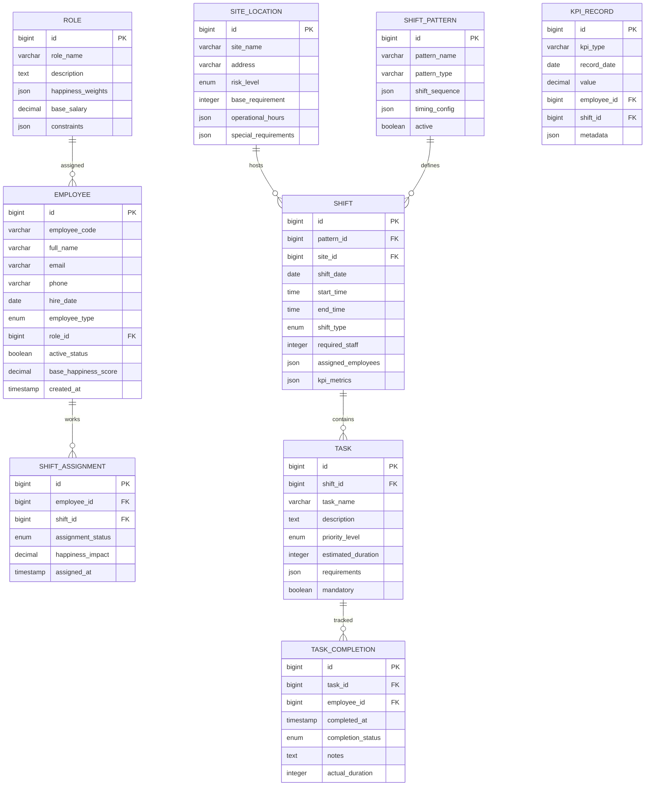
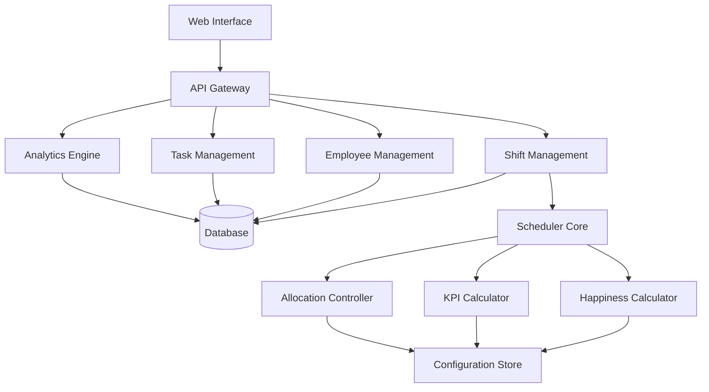

# Security Guard Shift Scheduling System Design Paper

## 1. System Overview

### 1.1 Purpose
Design a comprehensive task scheduling application for security guard management that incorporates shift patterns, employee satisfaction metrics, KPIs, and operational constraints as defined in the scheduling standard.

### 1.2 Core Components
- **Shift Management**: Pattern-based scheduling system
- **Employee Management**: Role-based personnel allocation
- **Location Management**: Site-specific requirements and risk assessment
- **Task Management**: Shift task lists and assignments
- **Analytics Engine**: KPI and Happiness Equation computation
- **Configuration System**: Flexible parameter management

---

## 2. Database Schema Design

### 2.1 Core Entities Relationship Diagram


### 2.2 Configuration Tables

#### 2.2.1 Happiness Equation Configuration
```sql
HAPPINESS_CONFIG {
    bigint id PK
    varchar config_name
    json wlb_weights
    json fairness_weights
    json recognition_weights
    json growth_weights
    json stress_weights
    json exhaustion_weights
    json role_modifiers
    timestamp effective_date
}
```

#### 2.2.2 KPI Configuration
```sql
KPI_CONFIG {
    bigint id PK
    varchar kpi_name
    varchar category
    decimal target_value
    decimal warning_threshold
    decimal critical_threshold
    varchar calculation_formula
    json measurement_period
    boolean is_active
}
```

#### 2.2.3 Allocation Strategy Configuration
```sql
ALLOCATION_STRATEGY {
    bigint id PK
    varchar strategy_name
    json risk_multipliers
    json time_slot_config
    json rotation_patterns
    json constraints
    boolean is_default
}
```

---

## 3. Core Business Logic Implementation

### 3.1 Shift Pattern Selection Algorithm
```python
class ShiftPatternSelector:
    def __init__(self, site_requirements, budget_constraints):
        self.site_requirements = site_requirements
        self.budget_constraints = budget_constraints
        
    def select_pattern(self):
        if (self.site_requirements['high_coverage'] and 
            self.site_requirements['diverse_activities']):
            return self.get_888_pattern()
        elif (self.site_requirements['basic_requirements'] and 
              self.budget_constraints['limited_budget']):
            return self.get_1212_pattern()
        else:
            return self.get_mixed_pattern()
    
    def get_888_pattern(self):
        return {
            'pattern_type': '8-8-8',
            'shifts': [
                {'name': 'Morning', 'start': '06:00', 'end': '14:00'},
                {'name': 'Afternoon', 'start': '14:00', 'end': '22:00'},
                {'name': 'Night', 'start': '22:00', 'end': '06:00'}
            ]
        }
```

### 3.2 Happiness Equation Calculator
```python
class HappinessCalculator:
    def __init__(self, employee, shift_assignments, config):
        self.employee = employee
        self.shift_assignments = shift_assignments
        self.config = config
        
    def calculate_happiness(self):
        weights = self.config['role_weights'][self.employee.employee_type]
        
        numerator = (
            weights['wlb'] * self.calculate_wlb_score() +
            weights['fairness'] * self.calculate_fairness_score() +
            weights['recognition'] * self.calculate_recognition_score() +
            weights['growth'] * self.calculate_growth_score()
        )
        
        denominator = (
            0.6 * self.calculate_stress_score() +
            0.4 * self.calculate_exhaustion_score()
        )
        
        return numerator / denominator if denominator != 0 else 0.0
    
    def calculate_wlb_score(self):
        # Implementation based on days off, rest time, schedule notice
        pass
    
    def calculate_fairness_score(self):
        # Implementation based on shift distribution equality
        pass
```

### 3.3 KPI Computation Engine
```python
class KPICalculator:
    def __init__(self, time_period, site_id=None):
        self.time_period = time_period
        self.site_id = site_id
        
    def calculate_operational_kpis(self):
        return {
            'coverage_rate': self.calculate_coverage_rate(),
            'unfilled_posts': self.calculate_unfilled_posts(),
            'security_incidents': self.get_security_incidents(),
            'response_time': self.calculate_avg_response_time()
        }
    
    def calculate_coverage_rate(self):
        total_required = self.get_total_required_staff()
        total_assigned = self.get_total_assigned_staff()
        return (total_assigned / total_required) * 100 if total_required > 0 else 0
```

---

## 4. Task Management System

### 4.1 Task List Generation
```python
class TaskManager:
    def __init__(self, shift, site_requirements):
        self.shift = shift
        self.site_requirements = site_requirements
        
    def generate_task_list(self):
        base_tasks = self.get_standard_tasks()
        risk_tasks = self.get_risk_based_tasks()
        special_tasks = self.get_special_requirements_tasks()
        
        return self.prioritize_tasks(
            base_tasks + risk_tasks + special_tasks
        )
    
    def get_standard_tasks(self):
        return [
            {
                'name': 'Perimeter Check',
                'duration': 30,
                'priority': 'HIGH',
                'mandatory': True
            },
            {
                'name': 'Access Control',
                'duration': 480,  # Entire shift
                'priority': 'HIGH', 
                'mandatory': True
            }
        ]
```

---

## 5. API Endpoint Design

### 5.1 Core Endpoints
```
POST   /api/shifts/schedule          # Generate shift schedule
GET    /api/shifts/{id}              # Get shift details
PUT    /api/shifts/{id}/assign       # Assign employees to shift
GET    /api/employees/{id}/happiness # Calculate employee happiness
GET    /api/kpis/operations          # Get operational KPIs
POST   /api/tasks/generate           # Generate task list for shift
```

### 5.2 Schedule Generation Endpoint
```python
@app.route('/api/shifts/schedule', methods=['POST'])
def generate_schedule():
    data = request.json
    
    scheduler = ShiftScheduler(
        start_date=data['start_date'],
        end_date=data['end_date'],
        site_id=data['site_id']
    )
    
    schedule = scheduler.generate_schedule()
    kpis = scheduler.calculate_schedule_kpis()
    happiness_scores = scheduler.calculate_overall_happiness()
    
    return jsonify({
        'schedule': schedule,
        'kpis': kpis,
        'happiness_scores': happiness_scores
    })
```

---

## 6. System Architecture

### 6.1 Component Diagram


### 6.2 Data Flow
1. **Configuration Load**: System loads shift patterns, KPI targets, happiness weights
2. **Schedule Generation**: Creates shifts based on patterns and site requirements
3. **Employee Allocation**: Assigns employees considering constraints and happiness
4. **Task Generation**: Creates task lists for each shift
5. **KPI Computation**: Calculates performance metrics
6. **Happiness Assessment**: Evaluates employee satisfaction
7. **Optimization Loop**: Re-balances if targets not met

---

## 7. Implementation Roadmap

### Phase 1: Core Schema & Basic Scheduling
- Implement database schema
- Create shift pattern management
- Develop basic scheduling algorithm

### Phase 2: Employee Management & Allocation
- Implement employee profiles and roles
- Develop allocation strategies
- Create constraint validation

### Phase 3: Analytics & Optimization
- Implement KPI computation engine
- Develop happiness equation calculator
- Create optimization algorithms

### Phase 4: Task Management & Reporting
- Implement task list generation
- Develop reporting dashboard
- Create monitoring tools

---

## 8. Key Benefits

1. **Standardized Scheduling**: Consistent application of scheduling standards
2. **Employee Satisfaction**: Built-in happiness optimization
3. **Performance Tracking**: Comprehensive KPI monitoring
4. **Flexible Configuration**: Adaptable to different site requirements
5. **Compliance Assurance**: Built-in legal and constraint validation

This design provides a robust foundation for implementing a security guard scheduling system that balances operational requirements, employee well-being, and organizational efficiency as defined in the scheduling standard.