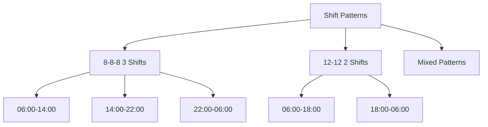
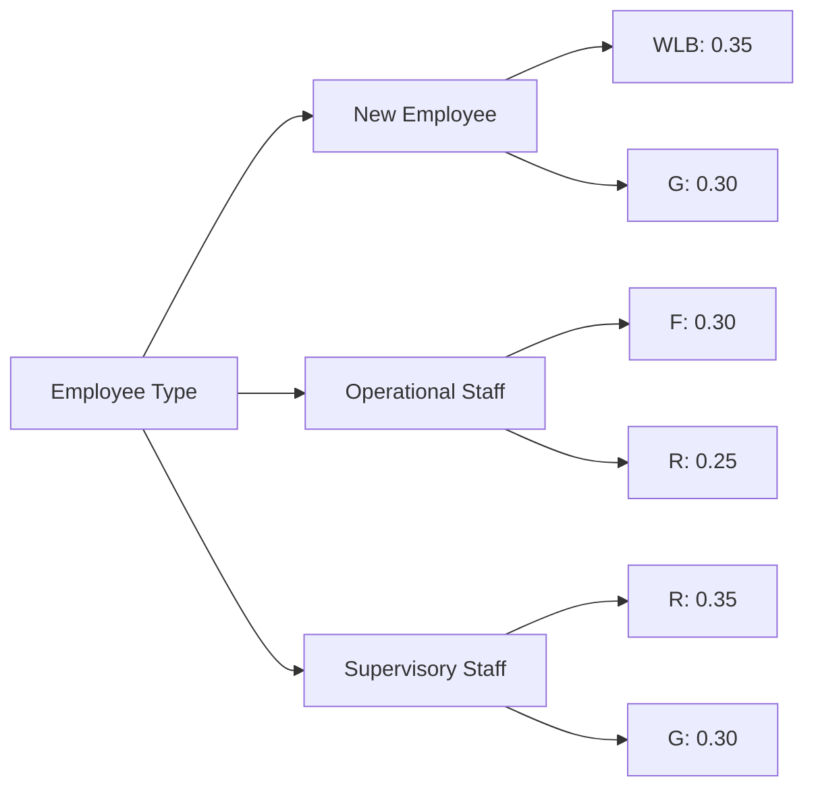
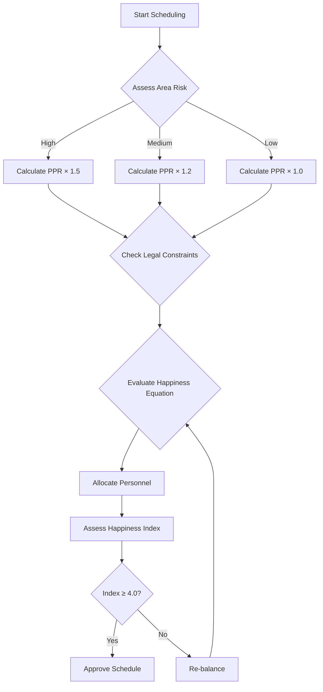
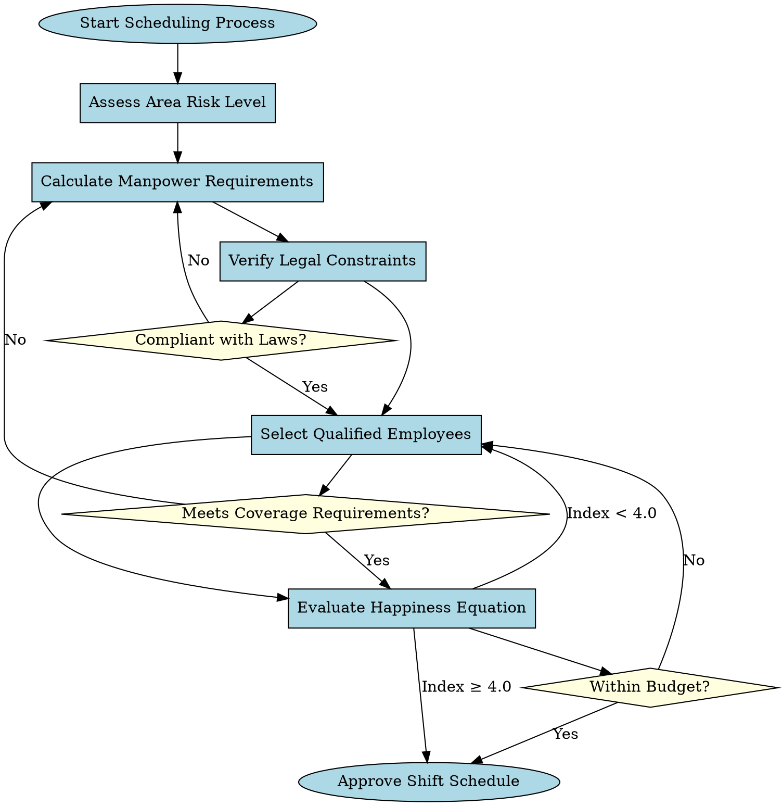
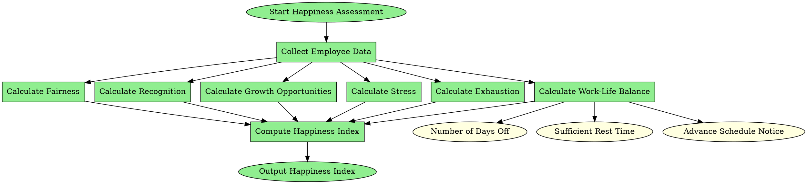
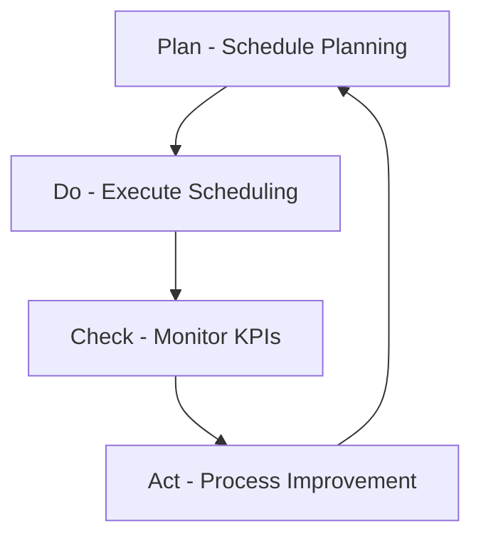

# Security Guard Shift Scheduling Standard

---

## Abstract
This document establishes standards for security guard shift scheduling, considering legal variables, manpower requirements, employee happiness equations, and operational constraints, while defining appropriate performance indicators and allocation strategies.

---

## 1. Standard Shift Pattern Formats

### 1.1 Standard Shift Patterns


### 1.2 Pattern Selection Criteria
```
IF (Area requires high coverage + Diverse activities)
   THEN Use 8-8-8 pattern
ELSE IF (Basic area requirements + Limited budget)
   THEN Use 12-12 pattern
```

---

## 2. Key Performance Indicators (KPIs)

### 2.1 Operational KPIs
| Category | Indicator | Target Value |
|----------|-----------|-------------|
| **Coverage** | Shift Coverage Rate | ≥ 95% |
| | Unfilled Posts | ≤ 2% |
| **Quality** | Security Incidents | ≤ 1 incident/month |
| | Response Time | ≤ 3 minutes |

### 2.2 Human Resources KPIs
| Category | Indicator | Target Value |
|----------|-----------|-------------|
| **Satisfaction** | Employee Happiness Index | ≥ 4.0/5.0 |
| | Turnover Rate | ≤ 5%/year |
| **Efficiency** | Productivity per Employee | ≥ 90% |
| | OT Utilization Rate | ≤ 15% |

### 2.3 Cost KPIs
| Indicator | Target Value |
|----------|-------------|
| Labor Cost per Hour | ≤ XXX THB |
| OT Budget Utilization Rate | ≤ 10% of total budget |
| Scheduling ROI | ≥ 1.5 |

---

## 3. Standard Happiness Equation

### 3.1 Main Equation
```
H = (0.3×WLB + 0.25×F + 0.2×R + 0.25×G) / (0.6×S + 0.4×E)
```

### 3.2 Weighted Variables by Employee Type


---

## 4. Allocation Strategies

### 4.1 Risk-Based Allocation Strategy
```python
def allocate_strategy(risk_level, time_slot):
    if risk_level == "HIGH":
        return base_requirement * 1.5
    elif risk_level == "MEDIUM":
        return base_requirement * 1.2
    else:
        return base_requirement

# Implementation Example
strategies = {
    "PEAK_HOURS": {"multiplier": 1.3, "min_staff": 2},
    "NORMAL_HOURS": {"multiplier": 1.0, "min_staff": 1},
    "LOW_HOURS": {"multiplier": 0.7, "min_staff": 1}
}
```

### 4.2 Shift Rotation Strategies
```
STRATEGY A: Morning → Afternoon → Night → Rest (for new employees)
STRATEGY B: Night → Rest → Morning → Afternoon (for senior employees)
STRATEGY C: Afternoon → Night → Rest → Morning (for general staff)
```

---

## 5. Selection Conditions and Logic

### 5.1 Scheduling Decision Matrix


### 5.2 Employee Selection Conditions
```python
class EmployeeSelection:
    def __init__(self):
        self.constraints = {
            'max_consecutive_nights': 3,
            'min_rest_hours': 11,
            'max_weekly_ot': 20,
            'max_consecutive_days': 6
        }
    
    def select_employee(self, shift_type, requirements):
        candidates = self.get_qualified_employees(requirements)
        ranked_candidates = self.rank_by_happiness_index(candidates)
        return self.apply_fairness_distribution(ranked_candidates)
```

---

## 6. Graphviz Logic Diagrams

### 6.1 Main Scheduling Logic


### 6.2 Employee Happiness Assessment Logic


---

## 7. Monitoring and Improvement Process

### 7.1 PDCA Cycle


### 7.2 Reporting Structure
- **Weekly Reports**: Coverage rates, OT utilization
- **Monthly Reports**: Happiness index, Security incidents
- **Quarterly Reports**: Strategy evaluation, Process improvements

---

## 8. Conclusion

This scheduling standard is designed to balance:
1. **Security Requirements** of the organization
2. **Well-being and Happiness** of employees
3. **Legal Requirements** and operational constraints
4. **Economic Efficiency** and appropriate budget utilization

Using comprehensive indicators covering operations, human resources, and costs, along with clear logic systems for decision-making and continuous improvement.