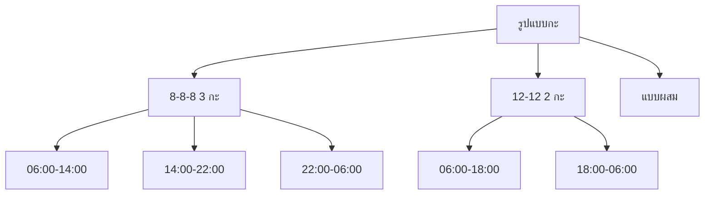
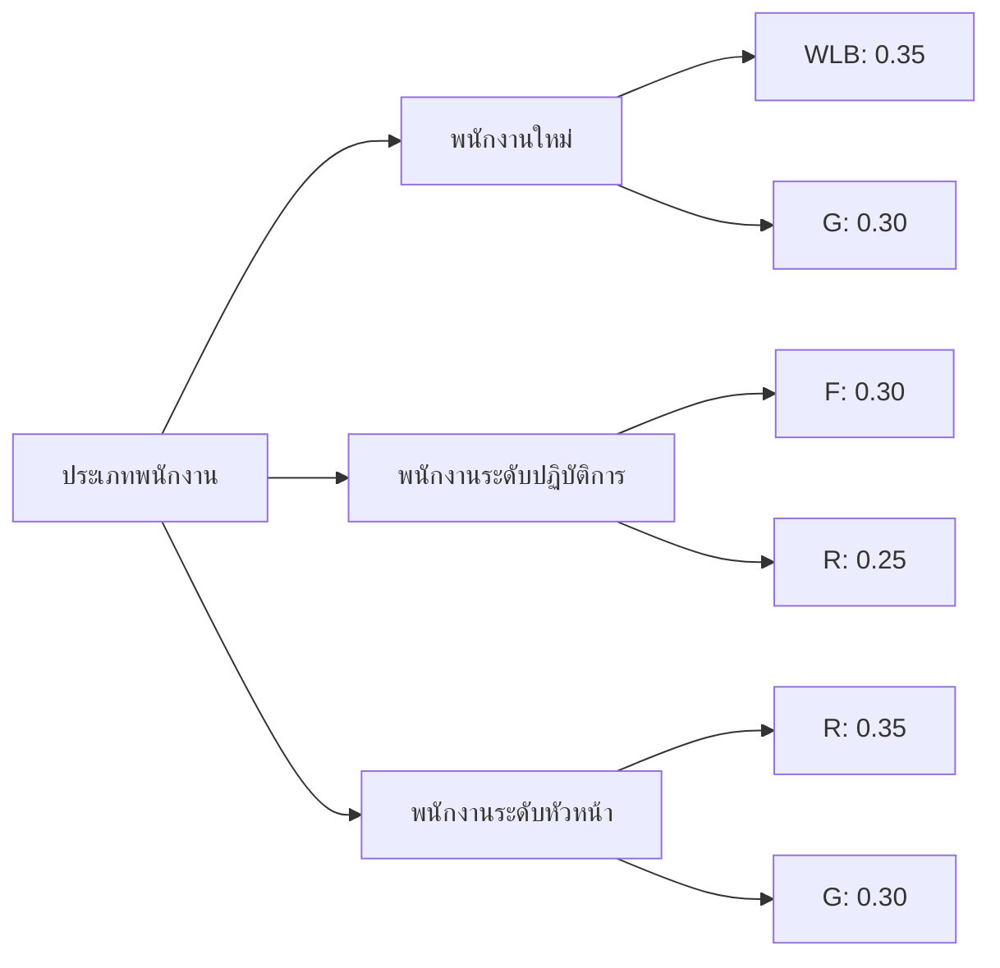
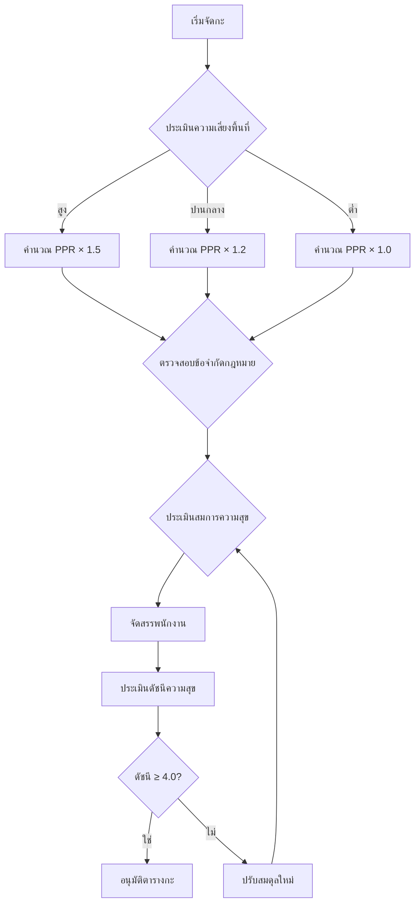
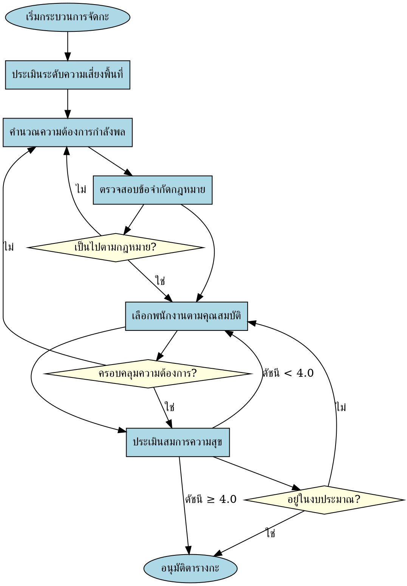
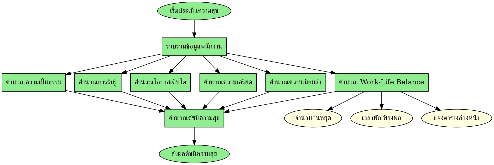
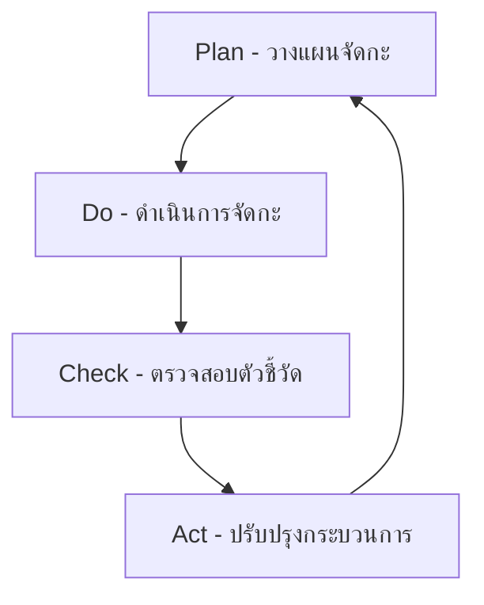

# มาตรฐานการจัดกะพนักงานรักษาความปลอดภัย
## (Security Guard Shift Scheduling Standard)

---

## บทคัดย่อ
เอกสารนี้กำหนดมาตรฐานการจัดกะพนักงานรักษาความปลอดภัย โดยพิจารณาตัวแปรด้านกฎหมาย ความต้องการกำลังพล สมการความสุขของพนักงาน และข้อจำกัดด้านปฏิบัติการ พร้อมกำหนดตัวชี้วัดและกลยุทธ์การจัดสรรที่เหมาะสม

---

## 1. มาตรฐานรูปแบบการจัดกะ

### 1.1 รูปแบบกะมาตรฐาน


### 1.2 เกณฑ์การเลือกรูปแบบกะ
```
IF (พื้นที่ต้องการความครอบคลุมสูง + กิจกรรมหลากหลาย)
   THEN ใช้รูปแบบ 8-8-8
ELSE IF (พื้นที่ต้องการพื้นฐาน + งบประมาณจำกัด)
   THEN ใช้รูปแบบ 12-12
```

---

## 2. ตัวชี้วัดประสิทธิภาพ (KPIs)

### 2.1 ตัวชี้วัดด้านปฏิบัติการ
| หมวดหมู่ | ตัวชี้วัด | ค่าเป้าหมาย |
|----------|-----------|-------------|
| **ความครอบคลุม** | อัตราการครอบคลุมกะ | ≥ 95% |
| | จำนวนจุดว่าง | ≤ 2% |
| **คุณภาพ** | จำนวนเหตุการณ์ความปลอดภัย | ≤ 1 ครั้ง/เดือน |
| | Response Time | ≤ 3 นาที |

### 2.2 ตัวชี้วัดด้านทรัพยากรบุคคล
| หมวดหมู่ | ตัวชี้วัด | ค่าเป้าหมาย |
|----------|-----------|-------------|
| **ความพึงพอใจ** | ดัชนีความสุขพนักงาน | ≥ 4.0/5.0 |
| | อัตราการลาออก | ≤ 5%/ปี |
| **ประสิทธิภาพ** | ผลิตภาพต่อพนักงาน | ≥ 90% |
| | อัตราการใช้ OT | ≤ 15% |

### 2.3 ตัวชี้วัดด้านต้นทุน
| ตัวชี้วัด | ค่าเป้าหมาย |
|----------|-------------|
| ต้นทุนแรงงานต่อชั่วโมง | ≤ XXX บาท |
| อัตราการใช้งบประมาณ OT | ≤ 10% ของงบประมาณทั้งหมด |
| ROI การจัดกะ | ≥ 1.5 |

---

## 3. สมการความสุขมาตรฐาน

### 3.1 สมการหลัก
```
H = (0.3×WLB + 0.25×F + 0.2×R + 0.25×G) / (0.6×S + 0.4×E)
```

### 3.2 ตัวแปรน้ำหนักตามประเภทพนักงาน


---

## 4. กลยุทธ์การจัดสรร

### 4.1 กลยุทธ์ตามระดับความเสี่ยง
```python
def allocate_strategy(risk_level, time_slot):
    if risk_level == "HIGH":
        return base_requirement * 1.5
    elif risk_level == "MEDIUM":
        return base_requirement * 1.2
    else:
        return base_requirement

# ตัวอย่างการประยุกต์ใช้
strategies = {
    "PEAK_HOURS": {"multiplier": 1.3, "min_staff": 2},
    "NORMAL_HOURS": {"multiplier": 1.0, "min_staff": 1},
    "LOW_HOURS": {"multiplier": 0.7, "min_staff": 1}
}
```

### 4.2 กลยุทธ์การหมุนเวียนกะ
```
STRATEGY A: เช้า → บ่าย → ดึก → พัก (สำหรับพนักงานใหม่)
STRATEGY B: ดึก → พัก → เช้า → บ่าย (สำหรับพนักงานอาวุโส)
STRATEGY C: บ่าย → ดึก → พัก → เช้า (สำหรับพนักงานทั่วไป)
```

---

## 5. เงื่อนไขและ Logic การเลือก

### 5.1 Decision Matrix สำหรับการจัดกะ


### 5.2 เงื่อนไขการเลือกพนักงาน
```python
class EmployeeSelection:
    def __init__(self):
        self.constraints = {
            'max_consecutive_nights': 3,
            'min_rest_hours': 11,
            'max_weekly_ot': 20,
            'max_consecutive_days': 6
        }
    
    def select_employee(self, shift_type, requirements):
        candidates = self.get_qualified_employees(requirements)
        ranked_candidates = self.rank_by_happiness_index(candidates)
        return self.apply_fairness_distribution(ranked_candidates)
```

---

## 6. Graphviz Logic Diagram

### 6.1 Main Scheduling Logic


### 6.2 Employee Happiness Assessment Logic


---

## 7. กระบวนการติดตามและปรับปรุง

### 7.1 PDCA Cycle


### 7.2 การรายงานผล
- **รายงานรายสัปดาห์**: อัตราความครอบคลุม, การใช้ OT
- **รายงานรายเดือน**: ดัชนีความสุข, เหตุการณ์ความปลอดภัย
- **รายงานรายไตรมาส**: การประเมินกลยุทธ์, การปรับปรุงกระบวนการ

---

## 8. บทสรุป

มาตรฐานการจัดกะนี้ได้รับการออกแบบมาเพื่อสร้างสมดุลระหว่าง:
1. **ความต้องการด้านความปลอดภัย** ขององค์กร
2. **ความเป็นอยู่และความสุข** ของพนักงาน
3. **ข้อกำหนดทางกฎหมาย** และข้อจำกัดด้านปฏิบัติการ
4. **ประสิทธิภาพทางเศรษฐกิจ** และการใช้งบประมาณอย่างเหมาะสม

โดยใช้ตัวชี้วัดที่ครอบคลุมทั้งด้านปฏิบัติการ ทรัพยากรบุคคล และต้นทุน พร้อมระบบ logic ที่ชัดเจนสำหรับการตัดสินใจและปรับปรุงอย่างต่อเนื่อง